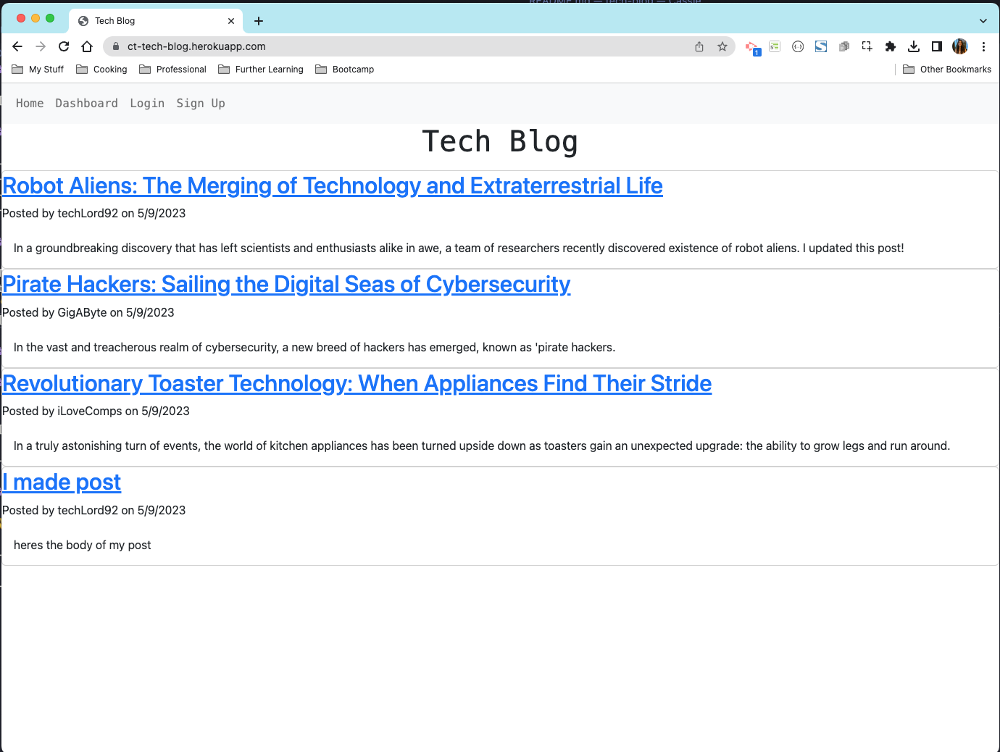
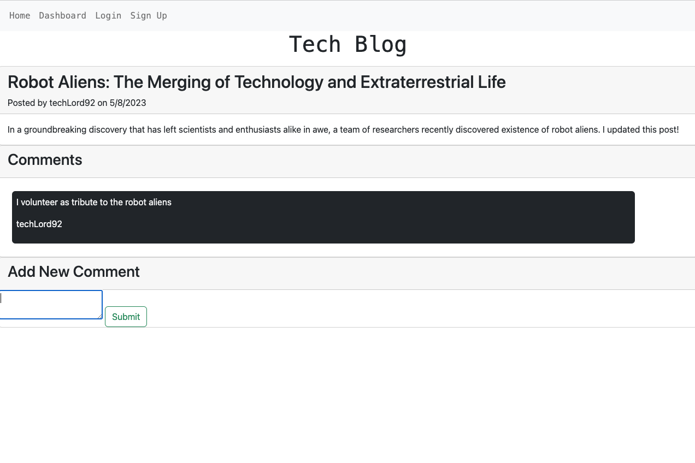

# Tech-Blog

## Table of Contents

- [**Description**](#📑-description)
- [**Usage**](#💻-usage)
- [**Technology**](#🚀-technology)
- [**Questions**](#❓-questions)

## 📑 Description

Tech Blog is a website where users can post their thoughts on the latest technology or anything they want. When a user visits the site they will see posts that other users have made and any comments as well. Once the user creates an account they can begin making their own blog posts. Users also have the ability to edit or even delete any posts that they have made.

[Visit Live Site Here](https://ct-tech-blog.herokuapp.com/)

## 💻 Usage

Tech blog hosts blog posts for everyone to see, just visit the site link above. In order to create posts, users must create an account. 

Once the account has been made from the homepage, users can create, edit, delete posts as well as comment on other users posts.

## 🚀 Technology

- **Handlebars**

## ❓ Questions

🖐 My name is Cassie! If you have any question about me or the project, feel free to contact me:

- Github: [CTep09](https://github.com/ctep09)

- Email: [CassandraY9@gmail.com](mailto:ctep09@gmail.com)
